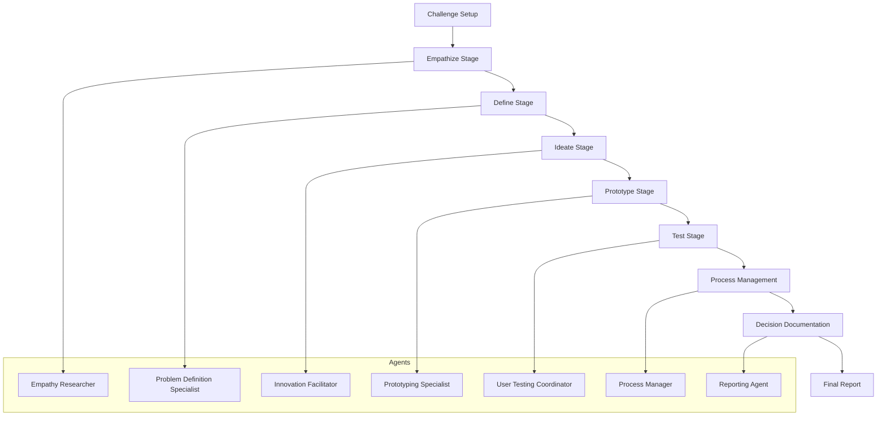

# Design Thinking AI Agent 🚀

Welcome to **Design Thinking AI**, an innovative, AI-powered application that reimagines the [design thinking process](https://www.interaction-design.org/literature/topics/design-thinking) through specialized **AI agents**. Built with [Streamlit](https://streamlit.io/), this interactive tool guides users—individuals or teams—through a structured, human-centered approach to problem-solving. By blending the creativity and empathy of design thinking with AI’s efficiency and intelligence, this project empowers you to address complex challenges and collaboratively craft impactful solutions.

---

## Table of Contents

- [Overview](#overview)
- [Workflow Diagram](#workflow-diagram)
- [Detailed Workflow Explanation](#detailed-workflow-explanation)
  - [Challenge Setup](#challenge-setup)
  - [AI Agents and Their Roles](#ai-agents-and-their-roles)
  - [Task Execution and Context Preservation](#task-execution-and-context-preservation)
  - [Human Feedback and Collaboration](#human-feedback-and-collaboration)
  - [Final Report and Decision Logging](#final-report-and-decision-logging)
- [Installation](#installation)
- [Usage](#usage)
- [Configuration](#configuration)
- [File Structure](#file-structure)
- [Contributing](#contributing)
- [License](#license)
- [Acknowledgements](#acknowledgements)
- [Summary of Workflow and Agent Roles](#summary-of-workflow-and-agent-roles)

---

## Overview

**Design Thinking AI** is a collaborative ecosystem where human creativity meets artificial intelligence. Powered by a team of specialized **AI agents**, this application guides users through the entire [design thinking process](https://en.wikipedia.org/wiki/Design_thinking)—a methodology centered on solving problems by deeply understanding users’ needs. The classic stages—**Empathize**, **Define**, **Ideate**, **Prototype**, and **Test**—are augmented with additional steps like **Process Management**, **Decision Documentation**, and **Final Reporting**, all driven by AI.

Each **AI agent** plays a pivotal role:
- The **Empathy Researcher** uncovers user pain points with precision.
- The **Innovation Facilitator** sparks creative breakthroughs.
- The **Reporting Agent** delivers a comprehensive final report.

Built with [Streamlit](https://streamlit.io/), the app provides an intuitive interface that fosters human-AI collaboration, capturing feedback at every stage to refine outcomes iteratively. Whether defining a challenge or testing a prototype, the **AI agents** ensure accuracy, creativity, and continuity throughout.

---

## Workflow Diagram

Below is a visual representation of the Design Thinking AI workflow:


---
*Note: You can view or edit this diagram using an online Mermaid editor.*

---



```mermaid
graph TD
    subgraph "Design Thinking AI Cluster (DTAAC)"
        subgraph "Initialization & Setup"
            A[Start] --> B(Initialize Session State)
            B --> C{API Keys Provided?}
            C -- Yes --> D(Initialize DesignThinkingCrew)
            C -- No --> E[Prompt for API Keys]
            E --> C
            D --> F{Design Thinking Guide Provided?}
            F -- Yes --> G(Initialize RAG with Guide)
            F -- No --> H[Use Default RAG]
            G --> I[Crew Ready]
            H --> I
        end

        subgraph "Challenge Setup"
            I --> J[Challenge Setup UI]
            J --> K{Challenge Definition Method?}
            K -- Provide Details --> L[Enter Challenge, Context, Constraints]
            K -- Generate from Domain --> M[Enter Domain, Context, Constraints]
            K -- Extract from Context --> N[Enter Context, Constraints]
            L --> O(Store Project Input)
            M --> P(Generate Challenge)
            N --> Q(Analyze Context & Extract Challenge)
            P --> O
            Q --> O
            O --> R[Display Challenge Details]
        end
        
        subgraph "Design Thinking Process"
              R --> S(Manager Briefing Task)
              S --> T[Current Stage: Empathize]

              subgraph "Empathize Stage"
                  T --> T1{Uploaded PDFs?}
                  T1 -- Yes --> T2(Process PDFs)
                  T1 -- No --> T3
                  T2 --> T3(Run Empathize Task)
                  T3 --> T4[Empathize Task Output]
                  T4 --> T5(Store Output & Mark Complete)
                  T5 --> T6[Display Output & Chat Interface]
                  T6 --> T7{Revise Task?}
                  T7 -- Yes --> T3
                  T7 -- No --> U[Current Stage: Define]
              end

              subgraph "Define Stage"
                  U --> U1{Uploaded PDFs?}
                  U1 -- Yes --> U2(Process PDFs)
                  U1 -- No --> U3
                  U2 --> U3(Run Define Task with Empathize Context)
                  U3 --> U4[Define Task Output]
                  U4 --> U5(Store Output & Mark Complete)
                  U5 --> U6[Display Output & Chat Interface]
                  U6 --> U7{Revise Task?}
                  U7 -- Yes --> U3
                  U7 -- No --> V[Current Stage: Ideate]
              end

              subgraph "Ideate Stage"
                  V --> V1{Uploaded PDFs?}
                  V1 -- Yes --> V2(Process PDFs)
                  V1 -- No --> V3
                  V2 --> V3(Run Ideate Task with Empathize & Define Context)
                  V3 --> V4[Ideate Task Output]
                  V4 --> V5(Store Output & Mark Complete)
                  V5 --> V6[Display Output & Chat Interface]
                  V6 --> V7{Revise Task?}
                  V7 -- Yes --> V3
                  V7 -- No --> W[Current Stage: Prototype]
              end

              subgraph "Prototype Stage"
                  W --> W1[Display Ideation Solutions]
                  W1 --> W2[Select Solutions to Prototype]
                  W2 --> W3{Uploaded PDFs?}
                  W3 -- Yes --> W4(Process PDFs)
                  W3 -- No --> W5
                  W4 --> W5(Run Prototype Task with Context & Selected Solutions)
                  W5 --> W6[Prototype Task Output]
                  W6 --> W7(Store Output & Mark Complete)
                  W7 --> W8[Display Output & Chat Interface]
                  W8 --> W9{Revise Task?}
                  W9 -- Yes --> W5
                  W9 -- No --> X[Current Stage: Test]
              end

              subgraph "Test Stage"
                  X --> X1[Display Prototyped Solutions]
                  X1 --> X2[Select Prototypes to Test]
                  X2 --> X3{Uploaded PDFs?}
                  X3 -- Yes --> X4(Process PDFs)
                  X3 -- No --> X5
                  X4 --> X5(Run Test Task with Context & Selected Prototypes)
                  X5 --> X6[Test Task Output]
                  X6 --> X7(Store Output & Mark Complete)
                  X7 --> X8[Display Output & Chat Interface]
                  X8 --> X9{Revise Task?}
                  X9 -- Yes --> X5
                  X9 -- No --> Y[Current Stage: Decision Archaeology]
              end

              subgraph "Decision Archaeology Stage"
                  Y --> Y1(Run Decision Archaeology Task with All Previous Outputs)
                  Y1 --> Y2[Decision Archaeology Output]
                  Y2 --> Y3(Store Output & Mark Complete)
                  Y3 --> Y4[Display Output & Chat Interface]
                  Y4 --> Y5{Revise Task?}
                  Y5 -- Yes --> Y1
                  Y5 -- No --> Z[Current Stage: Final Report]
              end

              subgraph "Final Report Stage"
                Z --> Z1(Run Reporting Task with all previous outputs)
                Z1 --> Z2[Final Report Output]
                Z2 --> Z3(Store output & Mark Complete)
              end
        end

        subgraph "Decision Log"
            T4 -- Log Decision --> AA[Decision Tracker]
            U4 -- Log Decision --> AA
            V4 -- Log Decision --> AA
            W6 -- Log Decision --> AA
            X6 -- Log Decision --> AA
            Y2 -- Log Decision --> AA
            Z2 -- Log Decision --> AA
            AA --> AB[Display Decision Log]
        end
                
        subgraph "Navigation"
            AC[Previous Stage Button] --> AD{Previous Stage Available?}
            AD -- Yes --> AE(Switch to Previous Stage & Tab)
            AD -- No --> AF[Disable Button]
            AG[Next Stage Button] --> AH{Next Stage Available?}
            AH -- Yes --> AI(Switch to Next Stage & Tab)
            AH -- No --> AJ[Disable button]
            AK[Jump to Stage] --> AL{Valid stage selected}
            AL -- Yes --> AM(Switch to Selected Stage)
            AL -- No --> AN[Disable Button]
        end
    end
    
```

## Detailed Workflow Explanation

### Challenge Setup 🎯

**Purpose:**  
Users define or generate the design challenge—specifying context, constraints, and success criteria—which is stored in `st.session_state.project_input`. This forms the basis for all subsequent tasks.

**Output:**  
A clear, actionable challenge statement that guides the outputs of the AI agents.

---

### AI Agents and Their Roles 🤖

The system is powered by a **Design Thinking Crew** consisting of several specialized AI agents:

- **Empathy Researcher**  
  **Stage:** Empathize  
  **Role:** Gathers deep insights about user behavior and pain points.  
  **Impact:** Establishes the foundational qualitative insights for the process.

- **Problem Definition Specialist**  
  **Stage:** Define  
  **Role:** Synthesizes research data into a clear problem statement and creates user personas.  
  **Impact:** Sharpens focus by clarifying the core problem to address.

- **Innovation Facilitator**  
  **Stage:** Ideate  
  **Role:** Generates creative solutions using techniques like brainstorming and lateral thinking.  
  **Impact:** Expands the range of possibilities with innovative ideas.

- **Prototyping Specialist**  
  **Stage:** Prototype  
  **Role:** Converts ideas into tangible prototype plans, specifying key features and milestones.  
  **Impact:** Bridges abstract ideas to practical, testable models.

- **User Testing Coordinator**  
  **Stage:** Test  
  **Role:** Designs testing protocols and gathers user feedback.  
  **Impact:** Validates the solution and suggests refinements.

- **Design Thinking Process Manager**  
  **Stage:** Process Management  
  **Role:** Oversees the workflow and ensures context is preserved across stages.  
  **Impact:** Maintains continuity throughout the process.

- **Design Process Reporter**  
  **Stage:** Decision Documentation & Final Report  
  **Role:** Documents the complete design journey, compiling insights, outputs, and decisions into a final report.  
  **Impact:** Provides transparency and a historical record of the process.

---

## Installation 🛠️

### Prerequisites

- Python 3.7 or later
- pip (Python package installer)

### Dependencies

Create a `requirements.txt` file with the following content:

```
streamlit
crewai
crewai_tools
```

Then, install the dependencies:

```bash
pip install -r requirements.txt
```

### Clone the Repository

Clone the repository to your local machine:

```bash
git clone https://github.com/kashyaparun25/Design-Thinking-AI-Agent.git
cd design-thinking-ai
```

---

## Usage 🚀

Run the application with:

```bash
streamlit run main.py
```

---

## License 📄

This project is licensed under the MIT License. See the [LICENSE](LICENSE) file for details.

---

## Summary of Workflow and Agent Roles

- **Challenge Setup:** Define the design challenge.
- **Empathize:** The **Empathy Researcher** gathers insights.
- **Define:** The **Problem Definition Specialist** creates a problem statement.
- **Ideate:** The **Innovation Facilitator** generates solutions.
- **Prototype:** The **Prototyping Specialist** develops prototypes.
- **Test:** The **User Testing Coordinator** conducts tests.
- **Process Management:** The **Process Manager** maintains workflow.
- **Decision Documentation:** The **Reporting Agent** compiles insights.
- **Final Report:** The **Design Process Reporter** provides a final overview.

---

Enjoy exploring innovative problem-solving with **Design Thinking AI**! 🚀
